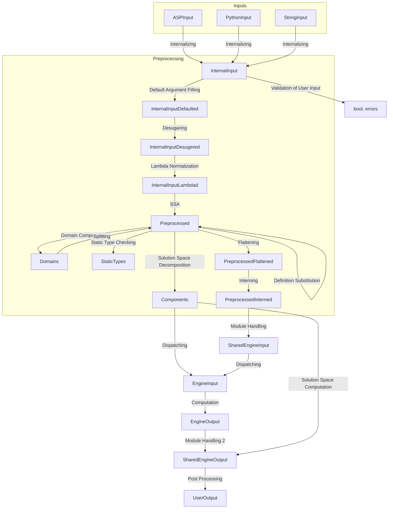

```mermaid
flowchart TD
	subgraph Inputs
		ASPInput
		PythonInput
		StringInput
	end

	UserInputResult["bool, errors"]
	SharedEngineInput
	EngineInput
	EngineOutput
	SharedEngineOutput
	UserOutput

	subgraph Preprocessing
		InternalInput
		InternalInputDefaulted
		InternalInputDesugered
		InternalInputLambdad
		Preprocessed
		Domains
		StaticTypes
		Components
		PreprocessedFlattened
		PreprocessedInterned
	end

	ASPInput -->|Internalizing| InternalInput
	PythonInput -->|Internalizing| InternalInput
	StringInput -->|Internalizing| InternalInput
	InternalInput -->|Validation of User Input| UserInputResult

	InternalInput -->|Default Argument Filling| InternalInputDefaulted
	InternalInputDefaulted -->|Desugaring| InternalInputDesugered
	InternalInputDesugered -->|Lambda Normalization| InternalInputLambdad
	InternalInputLambdad -->|SSA| Preprocessed

	Preprocessed -->|Domain Computation| Domains
	Preprocessed -->|Constant Folding| Preprocessed
	Domains -->|Splitting| Preprocessed
	Preprocessed -->|Splitting| Preprocessed
	Preprocessed -->|Definition Substitution| Preprocessed
	Preprocessed -->|Static Type Checking| StaticTypes
	Preprocessed -->|Solution Space Decomposition| Components

	Preprocessed -->|Flattening| PreprocessedFlattened
	PreprocessedFlattened -->|Interning| PreprocessedInterned
	PreprocessedInterned -->|Module Handling| SharedEngineInput
	Components -->|Dispatching| EngineInput
	SharedEngineInput -->|Dispatching| EngineInput
	EngineInput -->|Computation| EngineOutput
	EngineOutput -->|Module Handling 2| SharedEngineOutput
	Components -->|Solution Space Computation| SharedEngineOutput
	SharedEngineOutput -->|Post Processing| UserOutput
```
