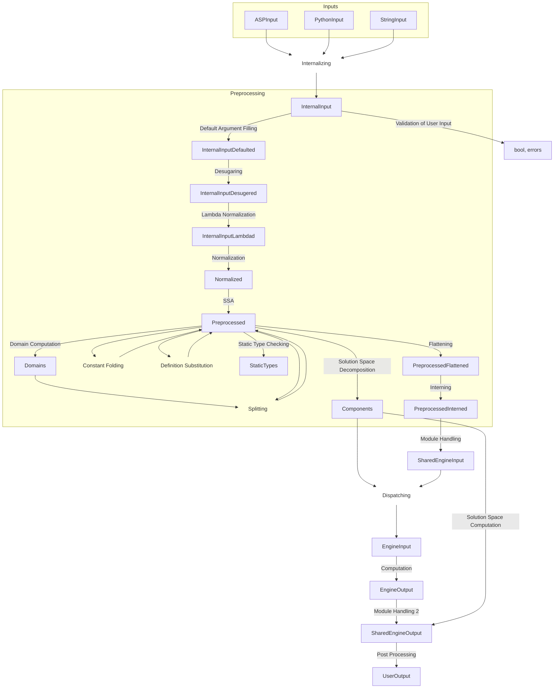

```mermaid
flowchart TD
	subgraph Inputs
		ASPInput
		PythonInput
		StringInput
	end

	UserInputResult["bool, errors"]
	SharedEngineInput
	EngineInput
	EngineOutput
	SharedEngineOutput
	UserOutput

	subgraph Preprocessing
		InternalInput
		InternalInputDefaulted
		InternalInputDesugered
		InternalInputLambdad
		Normalized
		Preprocessed
		Domains
		Splitting
		ConstantFolding["Constant Folding"]
		DefinitionSubstitution["Definition Substitution"]
		StaticTypes
		Components
		PreprocessedFlattened
		PreprocessedInterned
	end

	ASPInput --> Internalizing
	PythonInput --> Internalizing
	StringInput --> Internalizing
	Internalizing --> InternalInput
	InternalInput -->|Validation of User Input| UserInputResult

	InternalInput -->|Default Argument Filling| InternalInputDefaulted
	InternalInputDefaulted -->|Desugaring| InternalInputDesugered
	InternalInputDesugered -->|Lambda Normalization| InternalInputLambdad
	InternalInputLambdad -->|Normalization| Normalized
	Normalized -->|SSA| Preprocessed

	Preprocessed -->|Domain Computation| Domains
	Preprocessed --> ConstantFolding
	ConstantFolding --> Preprocessed
	Domains --> Splitting
	Preprocessed --> Splitting
	Splitting --> Preprocessed
	Preprocessed --> DefinitionSubstitution
	DefinitionSubstitution --> Preprocessed
	Preprocessed -->|Static Type Checking| StaticTypes
	Preprocessed -->|Solution Space Decomposition| Components

	Preprocessed -->|Flattening| PreprocessedFlattened
	PreprocessedFlattened -->|Interning| PreprocessedInterned
	PreprocessedInterned -->|Module Handling| SharedEngineInput
	Components --> Dispatching
	SharedEngineInput --> Dispatching
	Dispatching --> EngineInput
	EngineInput -->|Computation| EngineOutput
	EngineOutput -->|Module Handling 2| SharedEngineOutput
	Components -->|Solution Space Computation| SharedEngineOutput
	SharedEngineOutput -->|Post Processing| UserOutput

	style Internalizing fill:none,stroke:none
	style Splitting fill:none,stroke:none
	style ConstantFolding fill:none,stroke:none
	style DefinitionSubstitution fill:none,stroke:none
	style Dispatching fill:none,stroke:none
```
